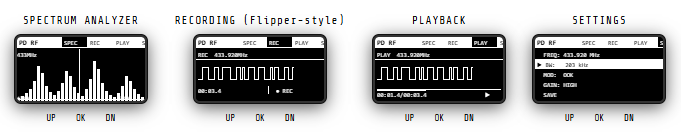

<p align="center">
  
</p>

<h1 align="center">📡 PD RF</h1>
<p align="center">
Portable RF Toolkit based on ESP32-C3
</p>


```text
██████╗ ██████╗     ██████╗ ███████╗
██╔══██╗██╔══██╗    ██╔══██╗██╔════╝
██████╔╝██║  ██║    ██████╔╝█████╗
██╔═══╝ ██║  ██║    ██╔══██╗██╔══╝
██║     ██████╔╝    ██║  ██║██║
╚═╝     ╚═════╝     ╚═╝  ╚═╝╚═╝
```

---------------------------------------------------------------------------------

## 🌐 Web Flasher 🌐 (beta)
[🌐 Open Web Flasher](https://agrantx.github.io/PD_RF/pd-rf-flasher.html)

---------------------------------------------------------------------------------

## 🌐 Web menu preview 🌐
[🌐 Open menu preview](https://agrantx.github.io/PD_RF/pd_rf_menu_preview.html)

---------------------------------------------------------------------------------

# 🔌 Pinout

### 📡 CC1101

| Signal | GPIO |
|---------|---------|
| CSN | GPIO 5 |
| GDO0 | GPIO 4 |
| GDO2 | GPIO 3 |
| MOSI | GPIO 7 |
| MISO | GPIO 2 |
| SCK | GPIO 6 |

### 🖥 OLED SSD1306

| Signal | GPIO |
|---------|---------|
| SDA | GPIO 9 |
| SCL | GPIO 10 |

### 💾 SD Card

| Signal | GPIO |
|---------|---------|
| CS | GPIO 8 |
| MOSI | GPIO 7 |
| MISO | GPIO 2 |
| SCK | GPIO 6 |

### 🔘 Buttons

| Button | GPIO |
|---------|---------|
| UP | GPIO 0 |
| DOWN | GPIO 1 |
| OK | GPIO 21 |

# ⚠️ Power Notes

NRF24L01 modules can be sensitive to power quality.

* Use a stable 3.3V supply
* Add a 10µF–100µF capacitor between VCC and GND near the module
* Do not connect VCC to 5V

# 📦 Hardware

* ESP32-C3
* CC1101
* OLED SSD1306 (I2C)
* MicroSD Card Module
* 3 Push Buttons
